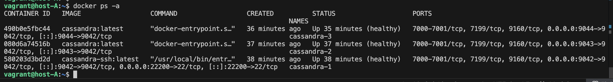
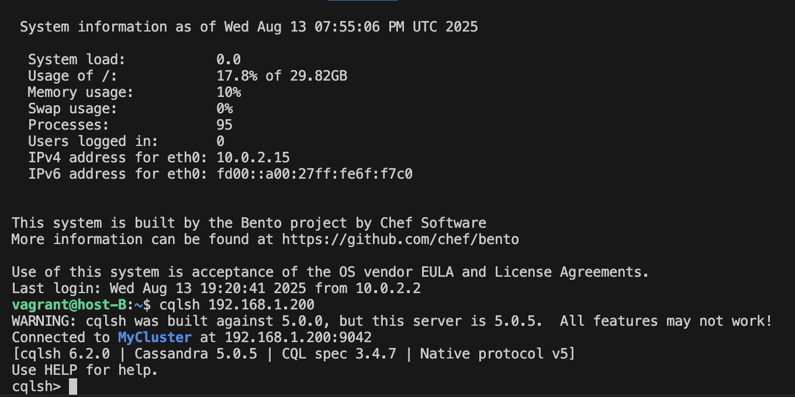
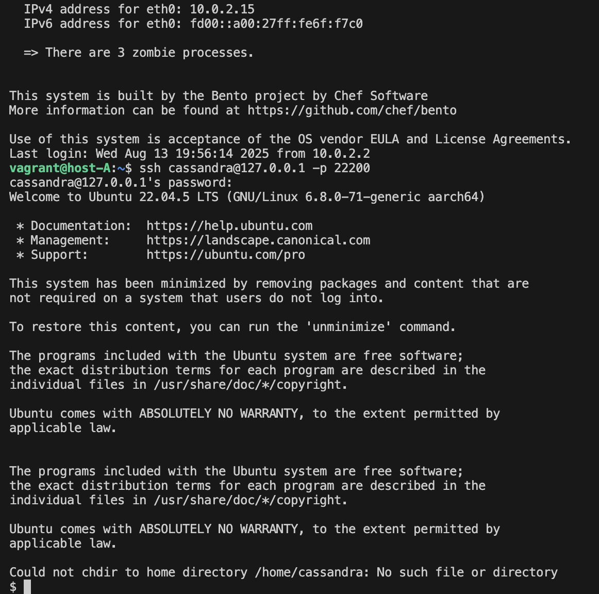

## Создаем виртуальные машины согласно ТЗ
`vagrant up  `
### Устанавливаем docker на 192.168.1.197
`ansible-playbook install_docker.yml -i inventory.ini`


### Копируем файлы для сборки docker образа на машину A
`scp -r cassandra-cluster vagrant@192.168.1.197:  `


### Собираем образ для ноды с ssh доступом из cassandra:latest
```
vagrant ssh host-A
cd ./cassandra-cluster
docker build -t cassandra-ssh ./cassandra-ssh-docker
```

## Запускаем развертывание кластера
#### В скрипте удаляются тома контейнеров (полезно при пересоздании кластера). Добавлена задержка создания нод, чтобы seed-нода успела инициализироваться. 
#### Также добавляется автоматическое создание docker сети `macvlan` (По умолчанию, хост не может напрямую общаться с контейнерами в `macvlan` сети, даже если они находятся в одной подсети. Для этого необходимо создать дополнительный `macvlan` интерфейс на самом хосте с IP-адресом из той же подсети `macvlan`.)
```
chmod +x ./run.sh
sudo ./run.sh
```


#### Проверяем статус кластера
`docker exec -it cassandra-1 nodetool status`
#### Проверяем участие нод в gossip (пример получения уникального токена: STATUS_WITH_PORT:18:NORMAL,-1251892226658967644)
`docker exec cassandra-1 nodetool gossipinfo`


#### Пробуем подключиться по SSH c машины A
`ssh cassandra@127.0.0.1 -p 22200`


## Подключение с машины B через cqlsh к 192.168.1.200
#### устанавливаем пакет pipx для того, чтобы установить cqlsh (в ubuntu 24.04 пакет cassandra больше не доступен напрямую из стандартных репозиториев) и подключаемся к созданным хостам в docker compose

```
vagrant ssh host-B

sudo apt install pipx

pipx ensurepath && source ~/.bashrc # автоматически добавляется ~/.local/bin в PATH и перечитываем конфиг 

pipx install cqlsh

cqlsh 192.168.1.200
```








